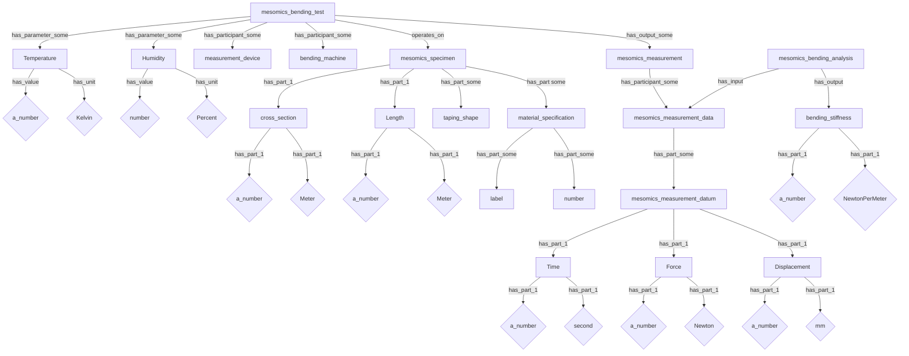
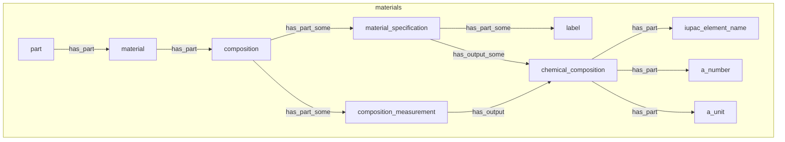
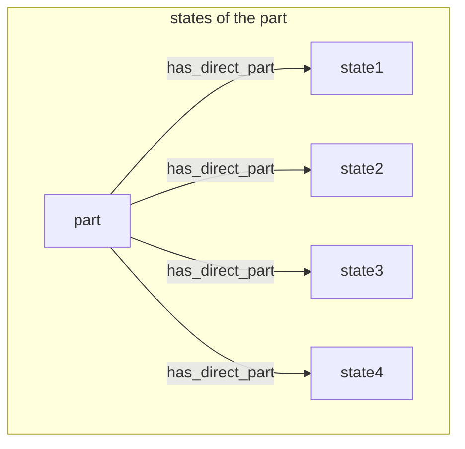
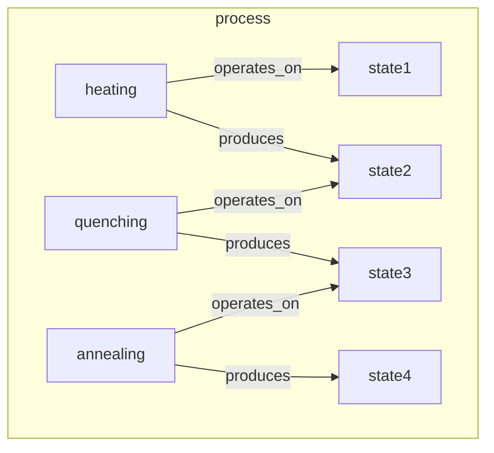
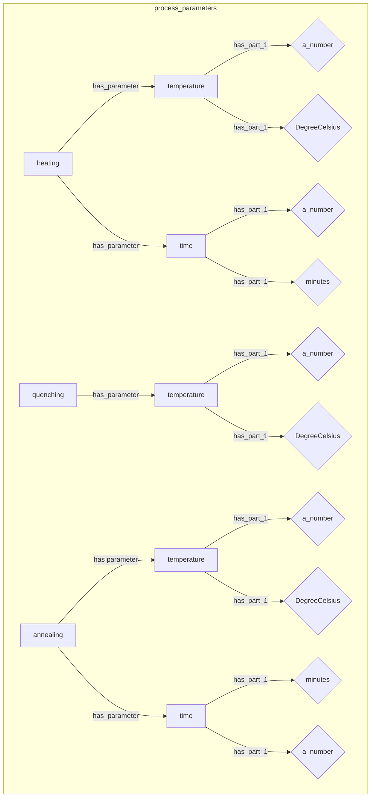
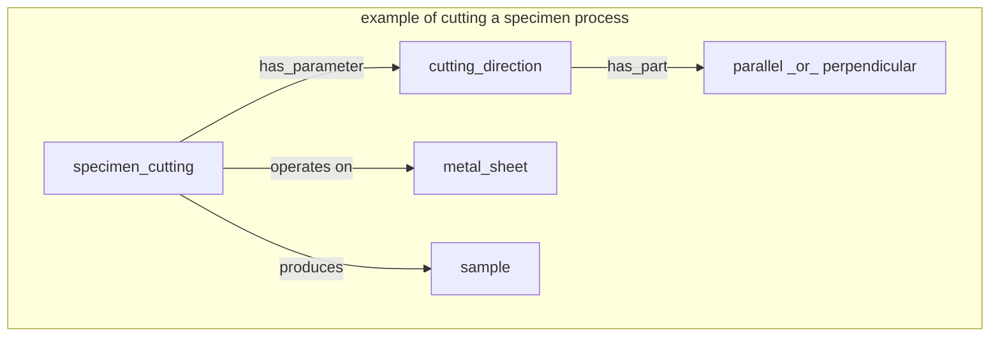
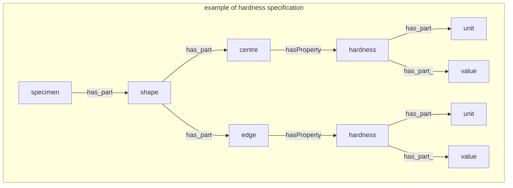
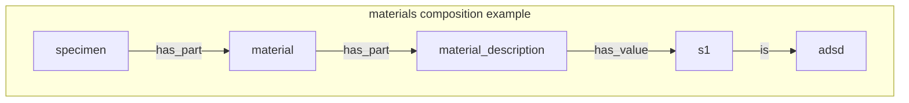

# schema 

## options 1: everything on the metal_sheet (workpiece) directly. 

(indentation means an "has-a" relation except when "is" is explicitly mentioned-)

- workpiece has:        +
   - composition        +
   - properties         + 
     - hardness         +
       - is HV          +
       - is CHD         +
       - is edge_hardness +
       - is center_hardness +
     - roughness  +
       - is Rz  +
       - is RzRy5 +
       - is Surface_factor_Ko   +
     - residual_stress_edge     +
       - axial                  +
       - tangential              +
     - Young_Modulus_E            +
     - Yield_stress_0.2           +
     - Tensile_strength (Rm)      
     - Fracture_strain
   - Processing                   +  
     - annealing                   +
     - quenching_and_tempering    +
     - hardening                   +
       - is Martensitic_hardening +
       - is bainite_hardening..  +
       - surface hardening        +
         - is case_hardening      +
           - case_hardening_method  +
             - is low_pressure_cooling +
             - simple_hardening       +
             - direct_hardening       +
           - surface_hardening_method   +
             - Nitration      +
             - Nitocarbonation      +
             - induction_hardening  +
      - surface treatment           +
        - shot_peening              +
      - manufacturing_protocol      +
        - forging               +
        - rolling               +
         - rolling_direction    +
           - length              +
           - width              +
      - Description             +
        - text                  +
  - fatigue_test                +
    - fatigue_specimen          +
      - name                    +
      - shape                   +
        - is non_standard_shape +
          - is IWM_fatigue_probe_shape  +
            - is Karsch024  +
            - is Burkart2011   +
            - is Bomas1999   +
            - is Schumacher2012  +
            - is Russenberger   +
            - is Rundzugprobe_D6   +
            - is IWM_rundProbe_Umlaufkerb +
            - is IWM_rundprobe_zylindrechen_teil +
      - cross_section   +
        - shape   +
          - round   +
          - rectangular  +
      - length   + 
      - notch  +
        - length  +
        - radius  +
        - elastic_stress_concentration_factor_kt  +
      - sketch    + 
        - image  +  
          - png_file +
      - diameter  +
        - minimum_value +
        - maximum_value  +
      - width +
      - thickness +
    - loading +
      - tension_compression +
      - three_point_bending +
      - rotating_bending +
      - torsion  +
      - four_point_bending +
    - parameters +
      - stress_ratio (equiv. R_ratio) +   
      - frequency   +
      - temperature +
      - environment 
        - is air
      - max_load_cycles +  (use max load, has part number of cycles has part maximum_value) 
      - staircase_method +
      - applied  +  # one can add temperature etc under applied. 
        - stress  
          - minimum +
          - maximum + 
          - median +
          - amplitude +
    - result/product + 
      - cycles + 
        - see max_load_cycles
      - specimen + 
        - description 
          - rapture + 
          - failure + 
            - type +
              - volume + 
              - surface +
            - cause +
              - inclusion +
                - chemical_elements +
                - shape +
                  - rectangular +
                  - round +
                - morphology +
                  - branched +
                  - elongated +
              - pore +
            - origin_from_edge 
            - area +
            - residual_stress +
              - axial +
              - tangential +
        - description  +
        - 
      - 

 
